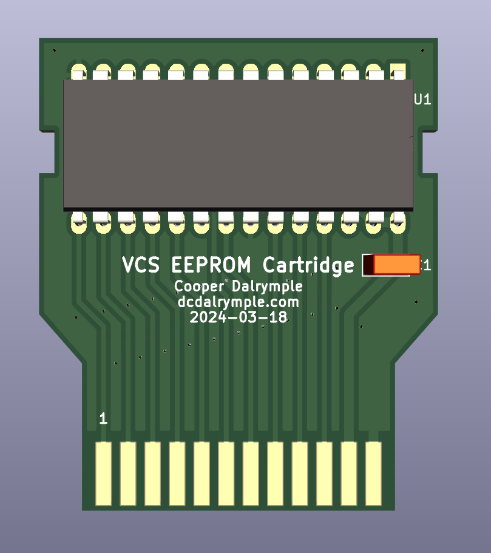
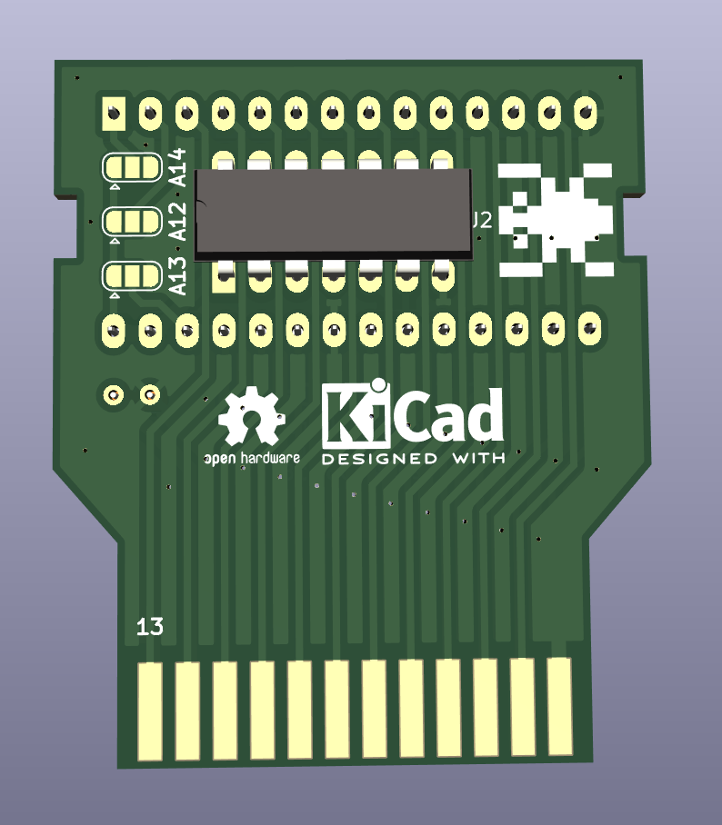

# Atari 2600/VCS EEPROM Cartridge

Simple 2k/4k Atari 2600 cartridge using easily writable EEPROM DIP chips as large as 32 kilobytes with manual bank selection using solder jumpers to store as many as 8 cartridge images. Requires a 74LS04 hex inverter to handle the chip enable signal to the ROM.

| Top                                                | Bottom                                                      |
| -------------------------------------------------- | ----------------------------------------------------------- |
|  |  |

Created using KiCad 7 under the GPL v3.0 license. Based on [Pixels Past cartridge](https://grandideastudio.com/portfolio/gaming/pixels-past/) originally manufactured and distributed by [AtariAge](https://www.atariage.com/).

## Compatible EEPROMs

* AT28C256
* AT28C64
* AT28C32
* AT28C16
